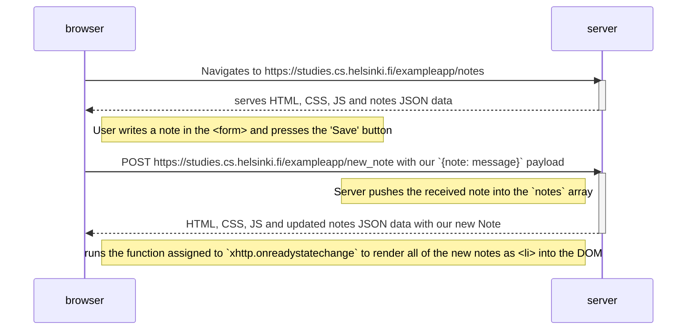

```mermaid
sequenceDiagram
    participant browser
    participant server

    browser->>server: Navigates to https://studies.cs.helsinki.fi/exampleapp/notes

    activate server
    server-->>browser: serves HTML, CSS, JS and notes JSON data
    %% in reality, the process involves making a GET request to fetch `notes.html`
    %% and making a request-response cycle to get the rest of the files (CSS, JS, JSON) in a chain,
    %% in order of appearance in the HTML document.
    deactivate server

    Note right of browser: User writes a note in the <form> and presses the 'Save' button
    browser->>server: POST https://studies.cs.helsinki.fi/exampleapp/new_note with our `{note: message}` payload

    activate server
    Note left of server: Server pushes the received note into the `notes` array
    server-->>browser: HTML, CSS, JS and updated notes JSON data with our new Note
    deactivate server

    Note right of browser: runs the function assigned to `xhttp.onreadystatechange` to render all of the new notes as <li> into the DOM
```
