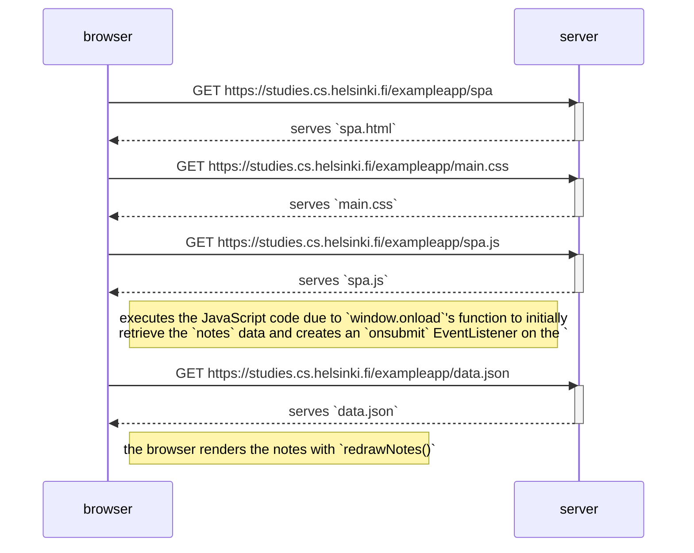

```mermaid
sequenceDiagram
    participant browser
    participant server

    browser->>server: GET https://studies.cs.helsinki.fi/exampleapp/spa

    activate server
    server-->>browser: serves `spa.html`
    deactivate server

    browser->>server: GET https://studies.cs.helsinki.fi/exampleapp/main.css

    activate server
    server-->>browser: serves `main.css`
    deactivate server

    browser->>server: GET https://studies.cs.helsinki.fi/exampleapp/spa.js

    activate server
    server-->>browser: serves `spa.js`
    deactivate server

    Note right of browser: executes the JavaScript code due to `window.onload`'s function to initially<br/> retrieve the `notes` data and creates an `onsubmit` EventListener on the `#notes_form` element.
    browser->>server: GET https://studies.cs.helsinki.fi/exampleapp/data.json

    activate server
    server-->>browser: serves `data.json`
    deactivate server

    Note right of browser: the browser renders the notes with `redrawNotes()`
```
